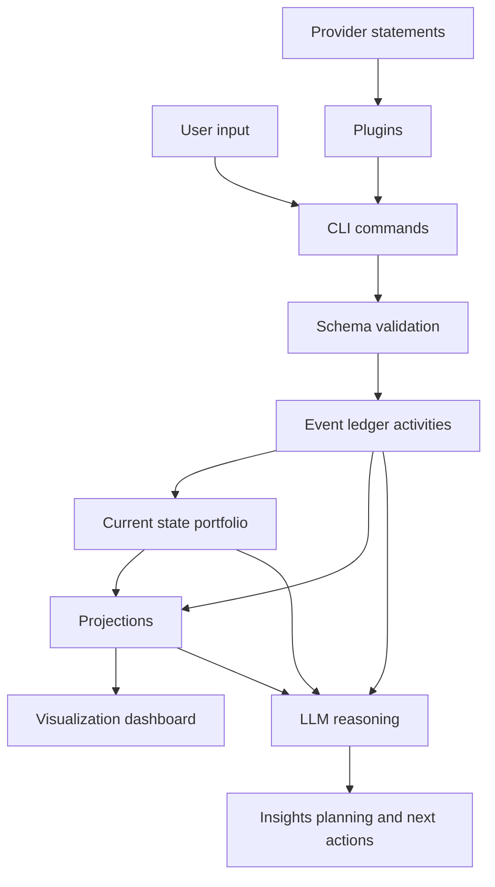

# rikdom

Portable, local-first wealth portfolio schema + storage toolkit.

`rikdom` is designed so your portfolio data can last for years as plain JSON files, independent of any broker app or SaaS dashboard.

## Why The Name "rikdom"

`rikdom` is a Norwegian word meaning "wealth" (or "riches").
The name reflects the project goal: treat wealth data as durable, long-lived information, not a locked product database.

## Why Now

With coding agents and LLMs, it is much easier to build your own asset management software and adapt it to your needs over time.
`rikdom` focuses on the durable layer beneath that iteration: a solid foundation for storing and evolving financial data, plus a plugin system you can extend with coding agents and enrich with reusable open-source plugins.

## What It Solves

- Define a portfolio for a person or company.
- Track holdings across stocks, REITs, funds, real estate, cash equivalents, digital assets and cryptocurrencies.
- Model recurring operations (monthly/yearly tasks) and keep an auditable "last done" history.
- Extend asset types with country-specific classes, metadata, and typed instrument attributes.
- Persist data in simple disk files (`JSON` + `JSONL`).
- Generate a minimal static dashboard for allocation and progress over time.
- Ingest provider statements through community plugins.

## Core Principles

- Local-first: data stays in your folder.
- Durable formats: JSON schema and line-delimited snapshots.
- Extensible by design: `metadata` and `extensions` fields.
- Agent-friendly: explicit schema + instructions for Codex/Claude.

## How rikdom differs from Ghostfolio and Wealthfolio

`rikdom` is not trying to be another full investment app.
It is a schema + CLI + plugin foundation focused on durability, portability, and auditable local files.

| Project | Primary shape | Storage model | Core focus |
| --- | --- | --- | --- |
| [rikdom](https://github.com/ricardocabral/rikdom) | Python CLI toolkit + JSON schema + plugin engine | Plain `JSON` + append-only `JSONL` in your repo/workspace | Long-term, local-first data durability and machine-readable portfolio workflows |
| [Ghostfolio](https://github.com/ghostfolio/ghostfolio) | Full web app (Angular + NestJS) for portfolio tracking | Server stack (`PostgreSQL` + `Redis`) with optional cloud offering | Operational wealth dashboard with rich UI, analytics, and continuous app runtime |
| [Wealthfolio](https://github.com/afadil/wealthfolio) | Desktop investment tracker (Tauri + React + Rust) | Local `SQLite` database | Beautiful local desktop experience with performance analytics and addon ecosystem |

Practical difference:

- Choose `rikdom` when you want open contracts and file-level control first.
- Choose Ghostfolio/Wealthfolio when you want a ready-made end-user app experience first.
- Combine them when needed: keep `rikdom` as your canonical data layer and export/sync to other tools via plugins.

## Information Flow



## Repository Structure

- `schema/` JSON schemas and default asset types
- `data/` local workspace files (`portfolio.json`, `snapshots.jsonl`, `import_log.jsonl`), gitignored
- `data-sample/` tracked starter templates copied into `data/` on first default CLI run
- `src/rikdom/` Python package (CLI, validation, import pipeline, visualization)
- `docs/` schema, storage, plugin docs, and execution plans
- `plugins/` local plugin implementations and manifests
- `scripts/` helper automation scripts (e.g., GitHub issue publishing)
- `tests/` unit and integration tests
- `out/` generated artifacts (e.g., dashboard/report output)
- `.codex/` Codex instruction files
- `.claude/` Claude instruction files
- `ROADMAP.md` phased roadmap and execution priorities

## Quick Start

### 1. Install uv

Install [`uv`](https://docs.astral.sh/uv/getting-started/installation/) for your platform.

### 2. Sync dependencies with uv

```bash
uv sync --extra schema
```

### 3. Bootstrap local workspace files

```bash
mkdir -p data
cp -n data-sample/portfolio.json data/portfolio.json
cp -n data-sample/snapshots.jsonl data/snapshots.jsonl
touch data/import_log.jsonl
```

### 4. Validate portfolio data

```bash
uv run rikdom validate
```

### 5. Aggregate by asset class

```bash
uv run rikdom aggregate
```

### 6. Append a historical snapshot

```bash
uv run rikdom snapshot
```

### 7. Generate dashboard

```bash
uv run rikdom visualize --out out/dashboard.html --include-current
```

## Schema Docs

- [Schema design](docs/schema-design.md)
- [Storage model](docs/storage.md)
- [Storage durability](docs/storage-durability.md)
- [Visualization module](docs/visualization.md)
- [Plugin system](docs/plugin-system.md)

## Plugins

- Canonical guide: [docs/plugin-system.md](docs/plugin-system.md)
- Quickstart: [plugins/README.md](plugins/README.md)

Core commands:

```bash
uv run rikdom plugins list --plugins-dir plugins
uv run rikdom import-statement --plugin csv-generic --input data-sample/sample_statement.csv --write
uv run rikdom render-report --plugin quarto-portfolio-report --plugins-dir plugins
uv run rikdom storage-sync --plugin duckdb-storage --plugins-dir plugins
uv run rikdom migrate --portfolio data-sample/portfolio.json --dry-run
```

Portfolio view plugin (`quarto-portfolio-report`) preview:


Schema upgrades: see [docs/migrations.md](docs/migrations.md).
Durability and journal compaction: see [docs/storage-durability.md](docs/storage-durability.md).

## AI Agent Skills

- `.codex/SKILL.md`
- `.claude/CLAUDE.md`

These files guide coding agents to safely analyze and evolve your data model.

## Contributing

See [CONTRIBUTING.md](CONTRIBUTING.md) for development setup, testing expectations, and pull request guidelines.

## Roadmap And Planning

- [Phased roadmap](ROADMAP.md)
- [Execution plan](docs/superpowers/plans/2026-04-20-pluggy-plugin-engine.md)
- GitHub issue templates: [.github/ISSUE_TEMPLATE/feature_request.md](.github/ISSUE_TEMPLATE/feature_request.md), [.github/ISSUE_TEMPLATE/bug_report.md](.github/ISSUE_TEMPLATE/bug_report.md)
- Publish local issue spec files (`*.md`): `scripts/create_github_issues.py --repo <owner/name> --issues-dir <path>`

## License

MIT (see `LICENSE`).
