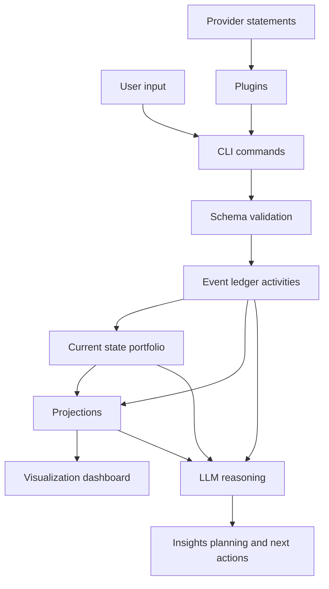
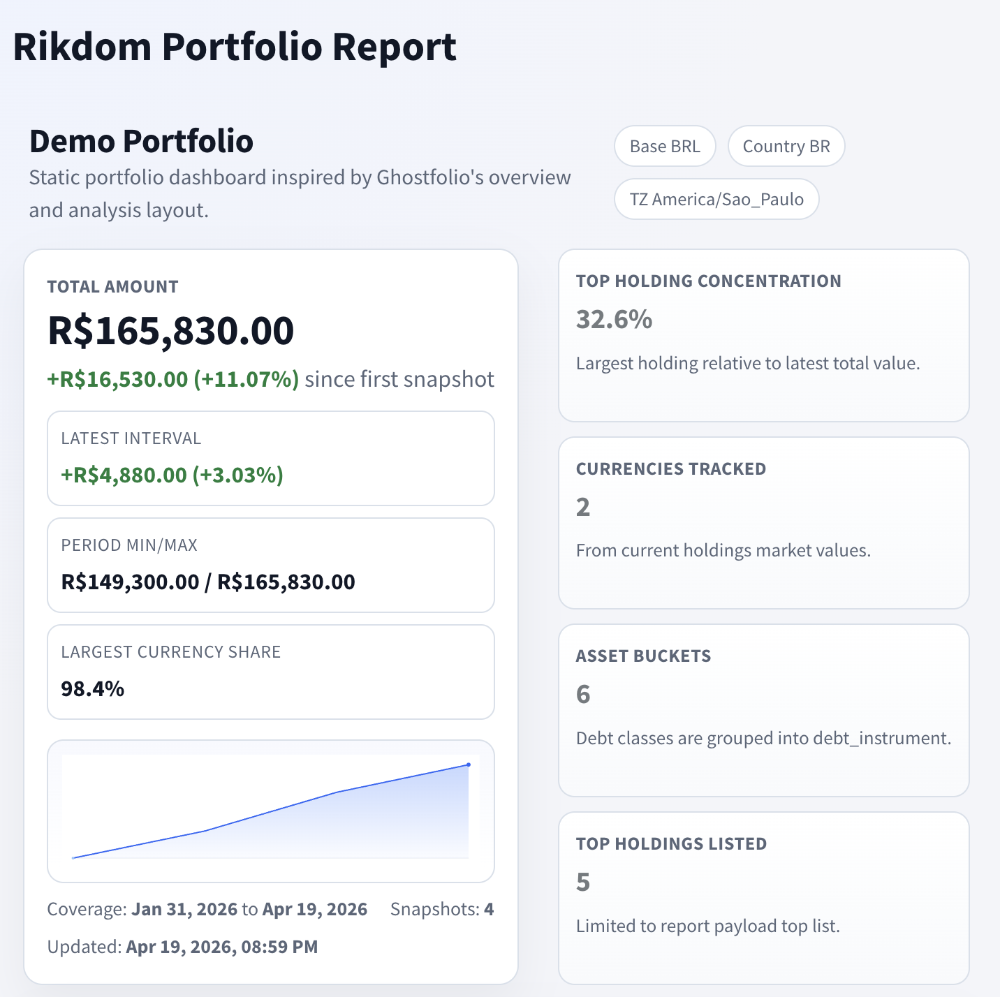
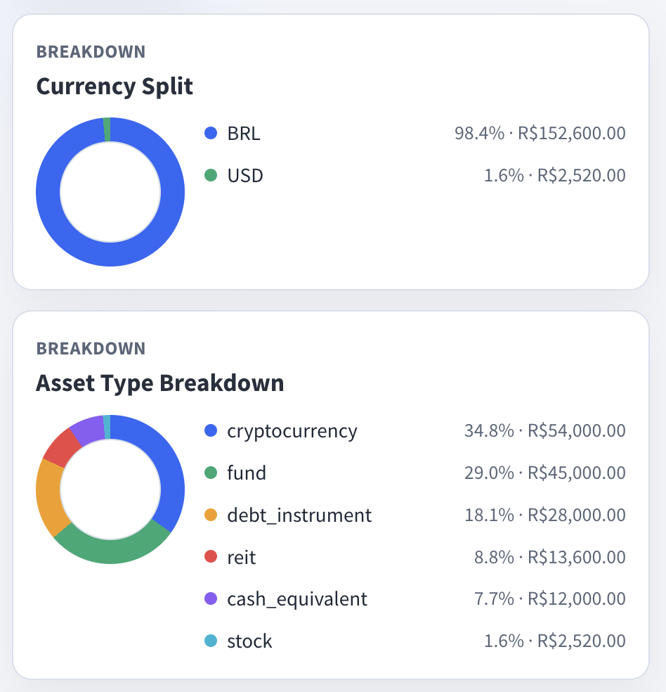

# rikdom

[](https://www.bestpractices.dev/projects/12618)
[](https://scorecard.dev/viewer/?uri=github.com/ricardocabral/rikdom)
[](https://github.com/ricardocabral/rikdom/actions/workflows/ci.yml)
[](https://github.com/ricardocabral/rikdom/actions/workflows/codeql.yml)
[](LICENSE)
[](https://www.python.org/downloads/)
[](https://github.com/astral-sh/ruff)
[](CONTRIBUTING.md)

Portable, local-first wealth portfolio schema + storage toolkit.

`rikdom` is designed so your portfolio data can last for years as plain JSON files, independent of any broker app or SaaS dashboard.

## Why The Name "rikdom"

`rikdom` is a Norwegian word meaning "wealth" (or "riches").
The name reflects the project goal: treat wealth data as durable, long-lived information, not a locked product database.

## Why Now

With coding agents and LLMs, it is much easier to build your own asset management software and adapt it to your needs over time.
`rikdom` focuses on the durable layer beneath that iteration: a solid foundation for storing and evolving financial data, plus a plugin system you can extend with coding agents and enrich with reusable open-source plugins.

## What It Solves

- Define a portfolio for a person or company.
- Track holdings across stocks, REITs, funds, real estate, cash equivalents, digital assets and cryptocurrencies.
- Model recurring operations (monthly/yearly tasks) and keep an auditable "last done" history.
- Extend asset types with country-specific classes, metadata, and typed instrument attributes.
- Persist data in simple disk files (`JSON` + `JSONL`).
- Generate a minimal static dashboard for allocation and progress over time.
- Ingest provider statements through community plugins.

## Core Principles

- Local-first: data stays in your folder.
- Durable formats: JSON schema and line-delimited snapshots.
- Extensible by design: `metadata` and `extensions` fields.
- Agent-friendly: explicit schema + instructions for Codex/Claude.

## How rikdom differs from Ghostfolio and Wealthfolio

`rikdom` is not trying to be another full investment app.
It is a schema + CLI + plugin foundation focused on durability, portability, and auditable local files.

| Project | Primary shape | Storage model | Core focus |
| --- | --- | --- | --- |
| [rikdom](https://github.com/ricardocabral/rikdom) | Python CLI toolkit + JSON schema + plugin engine | Plain `JSON` + append-only `JSONL` in your repo/workspace | Long-term, local-first data durability and machine-readable portfolio workflows |
| [Ghostfolio](https://github.com/ghostfolio/ghostfolio) | Full web app (Angular + NestJS) for portfolio tracking | Server stack (`PostgreSQL` + `Redis`) with optional cloud offering | Operational wealth dashboard with rich UI, analytics, and continuous app runtime |
| [Wealthfolio](https://github.com/afadil/wealthfolio) | Desktop investment tracker (Tauri + React + Rust) | Local `SQLite` database | Beautiful local desktop experience with performance analytics and addon ecosystem |

Practical difference:

- Choose `rikdom` when you want open contracts and file-level control first.
- Choose Ghostfolio/Wealthfolio when you want a ready-made end-user app experience first.
- Combine them when needed: keep `rikdom` as your canonical data layer and export/sync to other tools via plugins.

## Information Flow



## Repository Structure

- `schema/` JSON schemas and default asset types
- `data/` local workspace files (`portfolio.json`, `snapshots.jsonl`, `fx_rates.jsonl`, `import_log.jsonl`), gitignored
- `data/portfolio_registry.json` optional multi-portfolio registry (`main`, `paper`, `retirement`, etc.)
- `data/portfolios/<name>/` per-portfolio isolated data files when registry mode is used
- `data-sample/` tracked starter templates copied into `data/` on first default CLI run
- `src/rikdom/` Python package (CLI, validation, import pipeline, visualization)
- `docs/` schema, storage, plugin docs, and execution plans
- `plugins/` local plugin implementations and manifests
- `scripts/` helper automation scripts (e.g., GitHub issue publishing)
- `tests/` unit and integration tests
- `out/` generated artifacts (e.g., dashboard/report output)
- `.codex/` Codex instruction files
- `.claude/` Claude instruction files
- `ROADMAP.md` phased roadmap and execution priorities

## Quick Start

### 1. Install uv

Install [`uv`](https://docs.astral.sh/uv/getting-started/installation/) for your platform.

### 2. Sync dependencies with uv

```bash
make sync
```

### 3. Bootstrap local workspace files (optional)

The CLI auto-bootstraps `data/portfolio.json`, `data/snapshots.jsonl`, and `data/fx_rates.jsonl` from `data-sample/` on first run. To seed them manually:

```bash
make bootstrap
```

### 4. Validate portfolio data

```bash
make validate
```

### 5. Aggregate by asset class

```bash
make aggregate
```

### 6. Append a historical snapshot

```bash
make snapshot
```

`snapshot` now auto-ingests missing FX history for non-base holdings and locks the FX rates used into the snapshot row metadata (`metadata.fx_lock`) for deterministic valuation history.

### 7. Generate dashboard

```bash
make visualize
```

### 8. Multi-portfolio workspace (optional)

Initialize a registry with isolated data paths:

```bash
uv run rikdom workspace init --data-dir data
```

List registered portfolios:

```bash
uv run rikdom workspace list --data-dir data
```

Run commands against a specific portfolio:

```bash
uv run rikdom aggregate --data-dir data --portfolio-name retirement
uv run rikdom render-report --data-dir data --out-root out --portfolio-name retirement
```

Cross-portfolio rollup:

```bash
uv run rikdom workspace rollup --data-dir data
```

## User Guides

- [Native Multi-Currency Engine guide](docs/native-multi-currency-engine.md)
- [Visualization module](docs/visualization.md)
- [Plugin system](docs/plugin-system.md)

## Common Dev Tasks

```bash
make lint
make test
make check
# Example: run against paper portfolio in alternate workspace root
make validate DATA_DIR=workspace-data OUT_DIR=workspace-out PORTFOLIO_NAME=paper
```

## Schema Docs

- [Schema design](docs/schema-design.md)
- [Storage model](docs/storage.md)
- [Migrations](docs/migrations.md)
- [Storage durability](docs/storage-durability.md)

Quick migration command:

```bash
make migrate-dry-run
```

## Plugins

- Canonical guide: [docs/plugin-system.md](docs/plugin-system.md)
- Quickstart: [plugins/README.md](plugins/README.md)
- Scaffold a new plugin: `uv run rikdom plugin init my-plugin --dest plugins`
- Versioning and stability tiers: [docs/plugin-compatibility.md](docs/plugin-compatibility.md)

### Community plugin showcase

| Use case | Plugin | Description |
| --- | --- | --- |
| Importing statements | [`csv-generic`](plugins/csv-generic/README.md) | Imports holdings and activities from a generic CSV statement. |
| Importing statements | [`ghostfolio_export_json`](plugins/ghostfolio_export_json/README.md) | Imports holdings and activities from Ghostfolio JSON export files. |
| Importing statements | [`ibkr_flex_xml`](plugins/ibkr_flex_xml/README.md) | Imports activities from Interactive Brokers Flex XML statements. |
| Importing statements | [`b3-consolidado-mensal`](plugins/b3-consolidado-mensal/README.md) | Imports holdings from B3 consolidated monthly XLSX reports. |
| Asset type enrichment | [`asset-types-br-catalog`](plugins/asset-types-br-catalog/README.md) | Brazilian asset-type catalog for FIIs, public/private debt, BDRs, COEs, and special funds. |
| Storage sync / analytics | [`duckdb-storage`](plugins/duckdb-storage/README.md) | Mirrors rikdom canonical JSON data into DuckDB for local analytics workflows. |
| Reporting / visualization | [`quarto-portfolio-report`](plugins/quarto-portfolio-report/README.md) | Renders portfolio graphics and reports through Quarto. |

Plugin quick commands:

```bash
make plugins-list
make import-sample
make render-report
make storage-sync
```

Portfolio view plugin (`quarto-portfolio-report`) preview:




## AI Agent Skills

- `.codex/SKILL.md`
- `.codex/skills/rikdom-portfolio-analyst/SKILL.md`
- `.codex/skills/rikdom-extensibility-engineer/SKILL.md`
- `.claude/CLAUDE.md`

These files guide coding agents to safely analyze and evolve your data model.

## Contributing

See [CONTRIBUTING.md](CONTRIBUTING.md) for development setup, testing expectations, and pull request guidelines.

Project roadmap: [ROADMAP.md](ROADMAP.md)

## License

MIT (see `LICENSE`).
