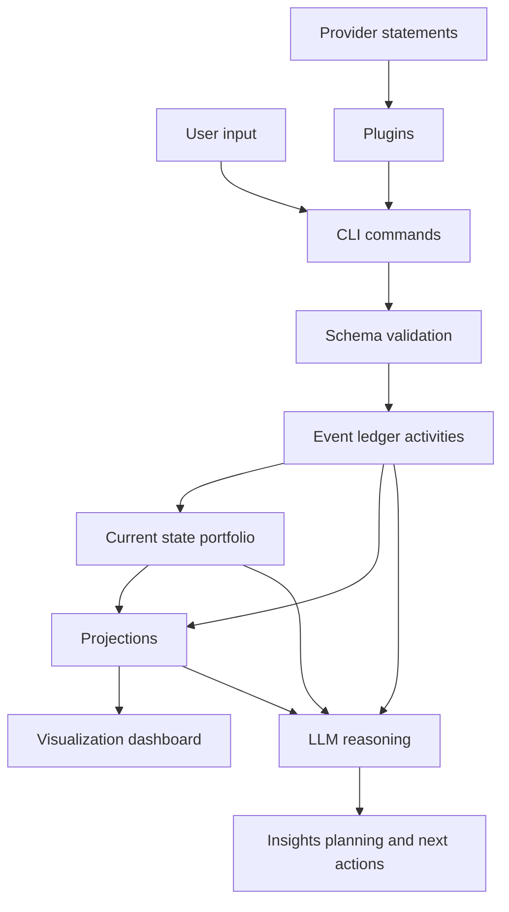

# rikdom

Portable, local-first wealth portfolio schema + storage toolkit.

`rikdom` is designed so your portfolio data can last for years as plain JSON files, independent of any broker app or SaaS dashboard.

## What It Solves

- Define a portfolio for a person or company.
- Track holdings across stocks, REITs, funds, real estate, cash equivalents, digital assets and cryptocurrencies.
- Model recurring operations (monthly/yearly tasks) and keep an auditable "last done" history.
- Extend asset types with country-specific classes, metadata, and typed instrument attributes.
- Persist data in simple disk files (`JSON` + `JSONL`).
- Generate a minimal static dashboard for allocation and progress over time.
- Ingest provider statements through community plugins.

## Core Principles

- Local-first: data stays in your folder.
- Durable formats: JSON schema and line-delimited snapshots.
- Extensible by design: `metadata` and `extensions` fields.
- Agent-friendly: explicit schema + instructions for Codex/Claude.

## Information Flow



## Repository Structure

- `schema/` JSON schemas and default asset types
- `data/` local workspace files (`portfolio.json`, `snapshots.jsonl`, `import_log.jsonl`), gitignored
- `data-sample/` tracked starter templates copied into `data/` on first default CLI run
- `src/rikdom/` Python package (CLI, validation, import pipeline, visualization)
- `docs/` schema, storage, plugin docs, and execution plans
- `plugins/` local plugin implementations and manifests
- `scripts/` helper automation scripts (e.g., GitHub issue publishing)
- `tests/` unit and integration tests
- `out/` generated artifacts (e.g., dashboard/report output)
- `.codex/` Codex instruction files
- `.claude/` Claude instruction files
- `ROADMAP.md` phased roadmap and execution priorities

## Quick Start

### 1. Install uv

Install [`uv`](https://docs.astral.sh/uv/getting-started/installation/) for your platform.

### 2. Sync dependencies with uv

```bash
uv sync --extra schema
```

### 3. Initialize local workspace and validate

```bash
uv run rikdom validate
```

The first command that uses default paths copies tracked templates from `data-sample/` into `data/` when files are missing.

### 4. Aggregate by asset class

```bash
uv run rikdom aggregate
```

### 5. Append a historical snapshot

```bash
uv run rikdom snapshot
```

### 6. Generate dashboard

```bash
uv run rikdom visualize --out out/dashboard.html --include-current
```

## Schema Docs

- [Schema design](docs/schema-design.md)
- [Storage model](docs/storage.md)
- [Storage durability](docs/storage-durability.md)
- [Visualization module](docs/visualization.md)
- [Plugin system](docs/plugin-system.md)

## Plugins

- Canonical guide: [docs/plugin-system.md](docs/plugin-system.md)
- Quickstart: [plugins/README.md](plugins/README.md)

Core commands:

```bash
uv run rikdom plugins list --plugins-dir plugins
uv run rikdom import-statement --plugin csv-generic --input data-sample/sample_statement.csv --write
uv run rikdom render-report --plugin quarto-portfolio-report --plugins-dir plugins
uv run rikdom storage-sync --plugin duckdb-storage --plugins-dir plugins
uv run rikdom migrate --portfolio data/portfolio.json --dry-run
```

Schema upgrades: see [docs/migrations.md](docs/migrations.md).
Durability and journal compaction: see [docs/storage-durability.md](docs/storage-durability.md).

## AI Agent Skills

- `.codex/SKILL.md`
- `.claude/CLAUDE.md`

These files guide coding agents to safely analyze and evolve your data model.

## Contributing

See [CONTRIBUTING.md](CONTRIBUTING.md) for development setup, testing expectations, and pull request guidelines.

## Roadmap And Planning

- [Phased roadmap](ROADMAP.md)
- [Execution plan](docs/superpowers/plans/2026-04-20-pluggy-plugin-engine.md)
- GitHub issue templates: [.github/ISSUE_TEMPLATE/feature_request.md](.github/ISSUE_TEMPLATE/feature_request.md), [.github/ISSUE_TEMPLATE/bug_report.md](.github/ISSUE_TEMPLATE/bug_report.md)
- Publish local issue spec files (`*.md`): `scripts/create_github_issues.py --repo <owner/name> --issues-dir <path>`

## License

MIT (see `LICENSE`).
