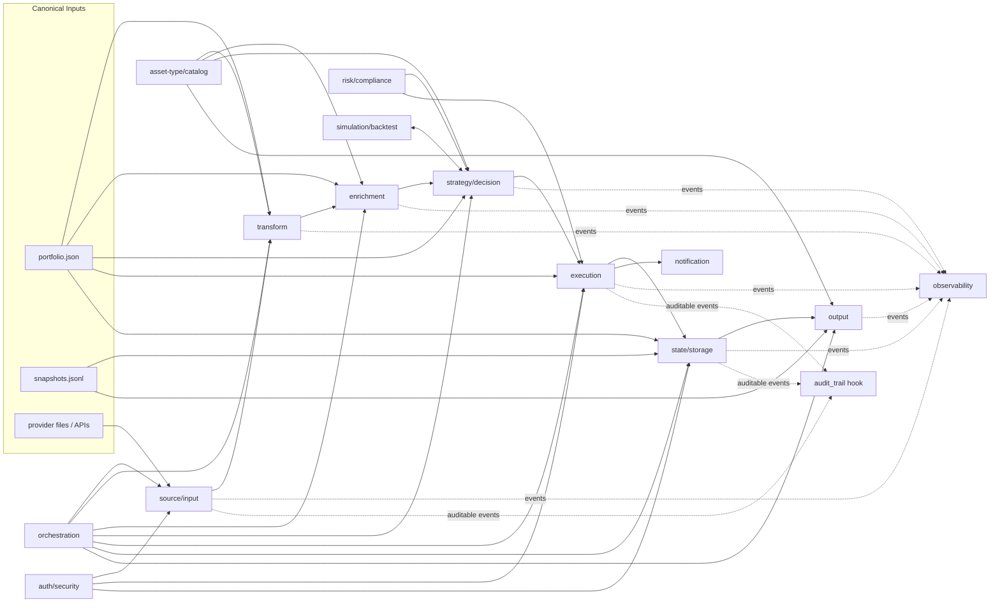

# Plugin System (Pluggy)

This document defines the `rikdom` plugin model using Pluggy.

It is written for both humans and coding agents who need to implement new plugins quickly and safely.

## What a Plugin Is

A plugin is a Python class discovered from `plugins/<plugin-name>/plugin.json` and loaded into the Pluggy runtime.

`rikdom` loads plugin code from:

- manifest: `plugins/<plugin-name>/plugin.json`
- module file: `plugins/<plugin-name>/<module>.py`
- class: `<class_name>` inside that module

The runtime is built in:

- `src/rikdom/plugin_engine/manifest.py`
- `src/rikdom/plugin_engine/loader.py`
- `src/rikdom/plugin_engine/runtime.py`
- `src/rikdom/plugin_engine/hookspecs.py`
- `src/rikdom/plugin_engine/pipeline.py`

## Lifecycle Diagram



## Plugin Taxonomy

`rikdom` defines the following plugin types in `PhaseName` (`src/rikdom/plugin_engine/contracts.py`).

| Plugin type | Lifecycle role | Typical input | Expected output | Side effects | Runtime status |
| --- | --- | --- | --- | --- | --- |
| `source/input` | Ingest external statements into normalized rikdom payloads | File path or remote payload | Normalized dict with holdings/events for merge | Reads files/APIs | Hook available: `source_input` (`firstresult=True`) |
| `transform` | Normalize/reshape portfolio data before advanced processing | Canonical portfolio + imported payloads | Transformed canonical structures | Usually pure transform | Taxonomy defined; add hookspec + pipeline entrypoint when implementing |
| `enrichment` | Add metadata (issuer, sector, indexer, benchmark, FX context) | Canonical holdings/catalog | Enriched holdings or metadata blobs | Optional external API reads | Taxonomy defined; add hookspec + pipeline entrypoint when implementing |
| `strategy/decision` | Turn data into allocation/rebalance decisions | Portfolio, snapshots, constraints | Decision set (target weights, deltas, actions) | May generate decision records | Taxonomy defined; add hookspec + pipeline entrypoint when implementing |
| `execution` | Convert decisions into executable intents/events | Decision set + policies | Execution plan or ledger-ready events | Writes to event logs/systems when enabled | Taxonomy defined; add hookspec + pipeline entrypoint when implementing |
| `output` | Render reports/dashboards/exports for humans or systems | `portfolio.json`, `snapshots.jsonl`, output options | Artifact list and metadata | Writes files | Hook available: `output` (`firstresult=True`) |
| `risk/compliance` | Evaluate risk/compliance gates before execution | Portfolio, exposures, decision set | Findings, blocked/allowed actions, limits report | May block downstream actions | Taxonomy defined; add hookspec + pipeline entrypoint when implementing |
| `state/storage` | Mirror/query canonical state in a storage backend | Canonical files + options | Sync/query/health payloads | Writes to DB/storage backend | Hooks available: `state_storage_sync`, `state_storage_query`, `state_storage_health` (`firstresult=True`) |
| `orchestration` | Coordinate phase execution order, retries, schedules | Pipeline context and run policies | Run plans / execution graph / run status | Triggers other phases | Taxonomy defined; add hookspec + pipeline entrypoint when implementing |
| `observability` | Emit logs/metrics/traces for plugin runs | Event name + payload + run context | Usually no functional return requirement | Emits telemetry | Hook available: `observability` (fan-out) |
| `auth/security` | Authorize plugin actions and redact/protect sensitive fields | Action context + principal/capabilities | Allow/deny decision and filtered payloads | Can deny operations | Taxonomy defined; add hookspec + pipeline entrypoint when implementing |
| `notification` | Notify users/systems about run outcomes | Run outcome payloads | Delivery result records | Sends messages/webhooks | Taxonomy defined; add hookspec + pipeline entrypoint when implementing |
| `simulation/backtest` | Run what-if and historical simulations | Strategy rules + historical snapshots | Backtest results/metrics | Reads historical datasets | Taxonomy defined; add hookspec + pipeline entrypoint when implementing |
| `asset-type/catalog` | Extend domain model with asset-type definitions | Context only | List of asset type definitions | Usually no side effect | Hook available: `asset_type_catalog` (fan-out, merged by `id`) |

Notes on dispatch semantics:

- `firstresult=True` hooks select one plugin result. Use one active plugin per run for these phases.
- Fan-out hooks collect from all registered plugins (`asset_type_catalog`, `observability`, `audit_trail`).
- `audit_trail` is a cross-cutting hook in `RikdomHookSpecs` for auditable events.

## Manifest Contract

Minimal Pluggy manifest:

```json
{
  "name": "quarto-portfolio-report",
  "version": "0.1.0",
  "api_version": "1.0",
  "plugin_types": ["output"],
  "module": "plugin",
  "class_name": "Plugin",
  "description": "Render portfolio report with Quarto"
}
```

Field requirements:

- Required: `name`, `version`, `plugin_types`, `module`, `class_name`
- Optional: `api_version` (defaults to `"1.0"`), `description`

Discovery and quick inspection:

```bash
uv run rikdom plugins list --plugins-dir plugins
```

## Hook Contracts

Hook specs are defined in `src/rikdom/plugin_engine/hookspecs.py`.

```python
class RikdomHookSpecs:
    def source_input(self, ctx, input_path): ...
    def asset_type_catalog(self, ctx): ...
    def output(self, ctx, request): ...
    def state_storage_sync(self, ctx, portfolio_path, snapshots_path, options): ...
    def state_storage_query(self, ctx, query_name, params): ...
    def state_storage_health(self, ctx, options): ...
    def observability(self, ctx, event, payload): ...
    def audit_trail(self, ctx, event, payload): ...
```

Shared runtime objects:

- `ctx`: `PluginContext(run_id, plugin_name, metadata={})`
- `request`: `OutputRequest(portfolio_path, snapshots_path, output_dir, options={})`

Result shape expectations:

- `source_input`: dict
- `asset_type_catalog`: list of dicts (engine merges unique `id`)
- `output`: dict with `plugin`, `artifacts`, optional `warnings`
- `state_storage_sync`: dict with sync report (`rows_written`, backend path, hashes, warnings)
- `state_storage_query`: dict query result payload
- `state_storage_health`: dict health status payload
- `observability` / `audit_trail`: side-effect hooks

## Detailed Plugin Examples

### 1) Source/Input plugin

Use case: parse broker statement CSV/XLSX and emit normalized holdings payload.

Manifest:

```json
{
  "name": "broker-csv-source",
  "version": "0.1.0",
  "api_version": "1.0",
  "plugin_types": ["source/input"],
  "module": "plugin",
  "class_name": "Plugin"
}
```

Implementation shape:

```python
from rikdom.plugin_engine.hookspecs import hookimpl


class Plugin:
    @hookimpl
    def source_input(self, ctx, input_path):
        # Parse provider statement and normalize to rikdom fields.
        return {
            "provider": "broker-csv-source",
            "statement_date": "2026-04-20",
            "holdings": [
                {
                    "id": "br_itub4",
                    "asset_type_id": "stock_br",
                    "label": "Itaú Unibanco PN",
                    "identifiers": {"ticker": "ITUB4", "country": "BR"},
                    "market_value": {"amount": 10000.0, "currency": "BRL"}
                }
            ]
        }
```

Pipeline call:

```python
from rikdom.plugin_engine.pipeline import run_import_pipeline

payload = run_import_pipeline(
    plugin_name="broker-csv-source",
    plugins_dir="plugins",
    input_path="data-sample/sample_statement.csv",
)
```

### 2) Asset-Type/Catalog plugin

Use case: publish Brazil-specific asset definitions (for example `fii`, `tesouro_direto`, `bdr`, `cri`, `cra`, `debenture`).

Manifest:

```json
{
  "name": "asset-types-br",
  "version": "0.1.0",
  "api_version": "1.0",
  "plugin_types": ["asset-type/catalog"],
  "module": "plugin",
  "class_name": "Plugin"
}
```

Implementation shape:

```python
from rikdom.plugin_engine.hookspecs import hookimpl


class Plugin:
    @hookimpl
    def asset_type_catalog(self, ctx):
        return [
            {
                "id": "fii",
                "label": "FII",
                "asset_class": "real_estate",
                "instrument_attributes": [
                    {"id": "ticker_b3", "type": "string", "required": True},
                    {"id": "cnpj", "type": "string", "required": False}
                ]
            },
            {
                "id": "tesouro_direto",
                "label": "Tesouro Direto",
                "asset_class": "fixed_income",
                "instrument_attributes": [
                    {"id": "indexer", "type": "string", "required": True},
                    {"id": "maturity_date", "type": "date", "required": True}
                ]
            }
        ]
```

Catalog build call:

```python
from rikdom.plugin_engine.pipeline import build_asset_type_catalog

catalog = build_asset_type_catalog("plugins")
```

Engine behavior:

- All `asset-type/catalog` plugins are loaded.
- Returned lists are merged.
- Duplicate `id` values are ignored after first occurrence.

### 3) Output plugin (Quarto-style)

Use case: render a visual portfolio report from canonical JSON files.

Manifest:

```json
{
  "name": "quarto-portfolio-report",
  "version": "0.1.0",
  "api_version": "1.0",
  "plugin_types": ["output"],
  "module": "plugin",
  "class_name": "Plugin"
}
```

Implementation shape:

```python
from pathlib import Path
from rikdom.plugin_engine.hookspecs import hookimpl


class Plugin:
    @hookimpl
    def output(self, ctx, request):
        out_dir = Path(request.output_dir)
        out_dir.mkdir(parents=True, exist_ok=True)

        html_path = out_dir / "portfolio-report.html"
        html_path.write_text("<html><body>report</body></html>", encoding="utf-8")

        return {
            "plugin": "quarto-portfolio-report",
            "artifacts": [{"type": "html", "path": str(html_path)}],
            "warnings": []
        }
```

CLI call:

```bash
uv run rikdom viz \
  --portfolio data-sample/portfolio.json \
  --snapshots data-sample/snapshots.jsonl \
  --out out/reports/dashboard.html
```

### 4) State/Storage plugin (DuckDB-style)

Use case: mirror canonical JSON into a queryable local DB backend.

Manifest:

```json
{
  "name": "duckdb-storage",
  "version": "0.1.0",
  "api_version": "1.0",
  "plugin_types": ["state/storage"],
  "module": "plugin",
  "class_name": "Plugin"
}
```

Implementation shape:

```python
from rikdom.plugin_engine.hookspecs import hookimpl


class Plugin:
    @hookimpl
    def state_storage_sync(self, ctx, portfolio_path, snapshots_path, options):
        db_path = options.get("db_path", "out/rikdom.duckdb")
        return {
            "rows_written": {
                "portfolio_header": 1,
                "holdings": 6,
                "snapshots": 4
            },
            "db_path": db_path,
            "source_hash_portfolio": "...",
            "source_hash_snapshots": "...",
            "warnings": []
        }

    @hookimpl
    def state_storage_health(self, ctx, options):
        return {"status": "ok", "db_path": options.get("db_path", "out/rikdom.duckdb")}

    @hookimpl
    def state_storage_query(self, ctx, query_name, params):
        if query_name == "top_holdings":
            return {"rows": []}
        return {"rows": [], "warnings": [f"Unknown query: {query_name}"]}
```

CLI call:

```bash
uv run rikdom storage-sync \
  --plugin duckdb-storage \
  --plugins-dir plugins \
  --portfolio data-sample/portfolio.json \
  --snapshots data-sample/snapshots.jsonl \
  --db-path out/rikdom.duckdb
```

## Concise Examples for Other Plugin Types

- `transform`: normalize all `market_value.amount` values to `settings.base_currency` before aggregation.
- `enrichment`: add `sector`, `issuer_rating`, and `duration_bucket` to holdings metadata.
- `strategy/decision`: compute rebalance deltas using target allocation and drift thresholds.
- `execution`: map rebalance deltas to operational events for ledger insertion with idempotency keys.
- `risk/compliance`: block execution if single-issuer concentration exceeds configured limits.
- `orchestration`: trigger `source/input -> transform -> enrichment -> output` daily and handle retries.
- `observability`: emit per-phase latency, error counters, and run IDs to metrics backend.
- `auth/security`: deny write-capable actions when plugin capability policy is read-only.
- `notification`: send run digest to Slack/email with artifacts and warnings.
- `simulation/backtest`: replay monthly snapshots to evaluate strategy drawdown and volatility.

## Author Workflow (Humans + Coding Agents)

1. Create plugin directory and manifest.

```text
plugins/<plugin-name>/
  plugin.json
  plugin.py
  README.md
  tests/
```

2. Add `plugin_types`, `module`, and `class_name` in `plugin.json`.
3. Implement a `Plugin` class and annotate hook methods with `@hookimpl`.
4. Keep hook return payloads strict and deterministic.
5. Validate discovery:

```bash
uv run rikdom plugins list --plugins-dir plugins
```

6. Validate behavior through pipeline/CLI entrypoints (use tracked fixtures, not local `data/*` defaults):

```bash
uv run rikdom viz --portfolio data-sample/portfolio.json --snapshots data-sample/snapshots.jsonl --out out/reports/dashboard.html
uv run rikdom storage-sync --plugin duckdb-storage --plugins-dir plugins --portfolio data-sample/portfolio.json --snapshots data-sample/snapshots.jsonl --db-path out/rikdom.duckdb
```

For source/input and asset-type/catalog checks:

```bash
uv run python -c "import json; from rikdom.plugin_engine.pipeline import run_import_pipeline; print(json.dumps(run_import_pipeline('broker-csv-source','plugins','data-sample/sample_statement.csv'), indent=2))"
uv run python -c "import json; from rikdom.plugin_engine.pipeline import build_asset_type_catalog; print(json.dumps(build_asset_type_catalog('plugins'), indent=2))"
```

7. Add tests:

- Unit tests for parser/mapper logic.
- Contract tests for hook return shape.
- Pipeline integration test using `run_*_pipeline` functions.
- Failure-path tests (invalid input, missing dependency, timeout).

8. Keep operational safety rules:

- Validate paths/options before file or DB writes.
- Avoid shell execution when a direct library call exists.
- Return actionable error messages for missing dependencies.
- Emit warnings for degraded/fallback modes.

## Testing Checklist

- Manifest is discoverable in `plugins list`.
- Plugin loads and class instantiates.
- Hook result shape matches contract.
- Artifacts or storage writes are produced at expected locations.
- Repeated execution is deterministic/idempotent where applicable.
- Error paths are explicit and test-covered.

## Authoring a plugin

This walkthrough uses the bundled SDK scaffold shipped as a package
resource under `src/rikdom/_resources/template-plugin/` (exposed via
`rikdom plugin init`) to build a working `source/input` plugin end-to-end.
For semver and stability tiers, see
[plugin-compatibility.md](plugin-compatibility.md).

### 1. Bootstrap from the scaffold

Use the `plugin init` subcommand. The slug must match
`^[a-z][a-z0-9-]{1,63}$`:

```bash
uv run rikdom plugin init my-plugin --dest plugins --description "Parse my broker statement"
```

Flags:

- `name` (positional, required): plugin slug / directory name.
- `--dest` (default: `plugins`): parent directory to create the plugin in.
- `--description` (optional): becomes `description` in `plugin.json`.

The command refuses to overwrite an existing directory and substitutes
`{{plugin_name}}` / `{{plugin_description}}` through the templates. Result:

```text
plugins/my-plugin/
  plugin.json           # Manifest (api_version "1.0", validated against the bundled rikdom._resources/plugin.manifest.schema.json)
  plugin.py             # Plugin class with @hookimpl source_input
  README.md             # Authoring notes pointing back here
  fixtures/sample.csv   # Three-row CSV used by the smoke test
  tests/test_plugin.py  # Unittest exercising parse_statement() and the hook
```

### 2. Implement the `source_input` hook

The scaffold already implements it. The minimal shape:

```python
from rikdom.plugin_engine.hookspecs import hookimpl


class Plugin:
    @hookimpl
    def source_input(self, ctx, input_path):
        return {
            "provider": "my-plugin",
            "generated_at": "2026-04-21T00:00:00Z",
            "holdings": [
                {
                    "id": "AAPL",
                    "asset_type_id": "stock",
                    "label": "AAPL",
                    "quantity": 10,
                    "market_value": {"amount": 1800.0, "currency": "USD"},
                    "identifiers": {"ticker": "AAPL"},
                }
            ],
            # Optional: "activities": [ ... ]
        }
```

Normalized payload shape consumed by `run_import_pipeline` and
`cmd_import_statement` (see `src/rikdom/cli.py` and `plugins/csv-generic/`
for the richest reference):

- `provider` (string): defaults source_system for the import log.
- `generated_at` (ISO-8601 string): statement generation timestamp.
- `holdings` (list of dicts): each requires `id`, `asset_type_id`, `label`,
  `market_value.amount`, `market_value.currency`; optional `quantity`,
  `identifiers`, `metadata`.
- `activities` (optional list): ledger events if the source exposes them.

See `src/rikdom/plugin_engine/hookspecs.py` for the full surface of all eight
v1 hooks.

### 3. Run the plugin's own tests

From the generated plugin directory:

```bash
cd plugins/my-plugin
uv run python -m unittest tests.test_plugin
```

The scaffold's test imports `plugin` directly, so no packaging or
`PYTHONPATH` setup is needed.

### 4. Verify discovery

```bash
uv run rikdom plugins list --plugins-dir plugins
```

Each entry includes `api_version`, `plugin_types`, `module`, and
`class_name` — the fields needed to load the plugin through Pluggy.

### 5. Run the import pipeline

Dry-run first, then `--write` to merge into the workspace portfolio:

```bash
uv run rikdom import-statement \
  --plugin my-plugin \
  --input plugins/my-plugin/fixtures/sample.csv \
  --data-dir data --out-root out \
  --dry-run

uv run rikdom import-statement \
  --plugin my-plugin \
  --input plugins/my-plugin/fixtures/sample.csv \
  --data-dir data --out-root out \
  --write
```

For versioning policy and stability tiers, see
[plugin-compatibility.md](plugin-compatibility.md).

## Contract Test Fixtures

Every Pluggy plugin that declares a v1 data hook (`source_input`,
`asset_type_catalog`, `output`, `state_storage_sync`, `state_storage_query`,
`state_storage_health`) must ship at least one contract-test fixture. The
runner in `src/rikdom/plugin_engine/contract_runner.py` discovers fixtures,
loads the plugin through the real `PluginRuntime`, invokes the declared
hook, optionally validates against a canonical schema, and asserts
byte-identical reruns (determinism). A dedicated CI step fails when a
plugin declares a data hook with zero fixtures.

### Fixture layout

```
plugins/<plugin-name>/fixtures/<case>/
  case.json           # required — describes hook + inputs (see below)
  input.*             # required for source_input hooks
  portfolio.json      # required for output / state_storage_sync hooks
  snapshots.jsonl     # required for output / state_storage_sync hooks
  expected.json       # canonical expected payload
  expected.jsonl      # alternative line-delimited form
  expected_error.json # alternative — for failure-mode fixtures
```

### `case.json` keys

| Key | Required | Description |
|---|---|---|
| `hook` | yes | One of the v1 hook names above. |
| `input` | source_input | Filename inside the fixture dir (defaults to first `input.*` match). |
| `portfolio` / `snapshots` | output, sync | Filenames inside the fixture dir. Default `portfolio.json` / `snapshots.jsonl`. |
| `options` | optional | `dict` passed through to hooks that accept options. |
| `query_name` / `params` | query | Inputs for `state_storage_query`. |
| `env` | optional | Env vars to set for the duration of the invocation (e.g. `RIKDOM_DISABLE_QUARTO=1`). |
| `requires` | optional | List of importable modules that must be available — the case is skipped if any is missing (e.g. `["duckdb"]`). |
| `ignore_fields` | optional | Keys to strip *anywhere* in the payload tree before equality/determinism compare. `generated_at` is always stripped. |
| `validate_schema` | optional | Alias for a canonical JSON Schema: `plugin-statement`, `portfolio`, or `snapshot`. |

### Determinism contract

For each case the runner invokes the hook twice in fresh tmpdirs and
asserts byte-identical canonical JSON after `ignore_fields` are stripped.
The contract uses a fixed `PluginContext.run_id` (`contract-<plugin>-<case>`)
so any hook that seeds IDs from the context will produce identical output.
Hooks that pull `datetime.now()` should list `generated_at` (or the
offending field name) in `ignore_fields`; this is the default for the
`generated_at` key.

### Failure-mode fixtures

Drop an `expected_error.json` file (instead of `expected.json`) with
`{"type": "<ExceptionClassName>", "message_contains": "<substring>"}` to
assert that a given input causes the hook to raise a specific error.

### Running the contract suite locally

```bash
uv run python -m unittest tests.test_plugin_contracts -v
```

CI runs the same command in a dedicated job so failures are directly
attributable to plugin contracts rather than mixed with other unit tests.
